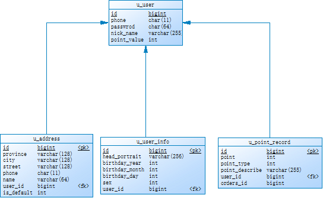
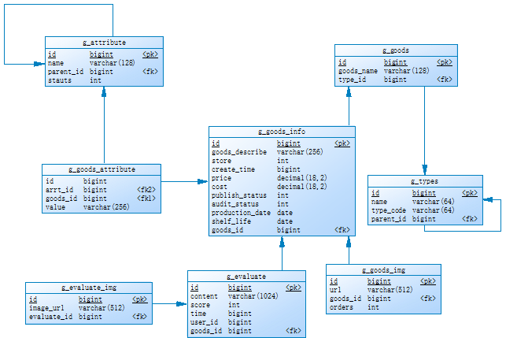

# lxsc
老邪商城 前后端分离 SpringCloud项目 学习阶段项目

## 第三章  环境搭建

### 3.1  数据库设计

#### 3.1.1 用户服务



#### 3.1.2  商品服务




#### 3.1.3  订单服服务


### 3.2  项目搭建

#### 3.2.1	技术选型

​	项目结构 : 

​		1.	前后端分离

​		2.	分布式微服务

​	开发工具 ：

​		1.	后端开发工具：IntelliJ IDEA

​		2.	前端开发工具：HBuilderX

​		3.	接口测试工具：Postman

​		4.	MySQL客户端：Navicat For MySQL

​		5.	数据库设计工具：PowerDesigner

​	JDK : 

​		1.	JDK1.8

​	后端开发框架 : 

​		1.	SpringBoot 2.3.12.RELEASE 

​		2.	SpringCloud Hoxton.SR11

​		3.	MyBaits

​	前端开发框架：

​		1.	vue

​		2.	jQuery

​	数据存储 ：

​		1.	MySQL 5.7.18

​		2.	Redis 3.2.9

​		3.	RabbitMQ 3.7.2

​	Web服务器：

​		1.	Tomcat 9

​		2.	Nginx 1.14.2

​	其他组件：

​		1.	Eureka注册中心

​		2.	OpenFeign Web服务访问客户端

​		3.	FastJson Json工具

​		4.	Seata 分布式事务框架

#### 	3.2.2  创建项目


#### 3.2.3  配置Eureka注册中心

##### 3.2.3.1  创建Maven模块


##### 3.2.3.2 配置pom.xml

```maven
<parent>
    <groupId>org.springframework.boot</groupId>
    <artifactId>spring-boot-starter-parent</artifactId>
    <!--配置SpringBoot版本 -->
    <version>2.3.12.RELEASE</version>
    <relativePath/> <!-- lookup parent from repository -->
</parent>
<groupId>com.laoxie</groupId>
<artifactId>eureka-server</artifactId>
<version>0.0.1-SNAPSHOT</version>
<name>eureka-server</name>
<description>Demo project for Spring Boot</description>
<properties>
	<java.version>1.8</java.version>
	<spring-cloud.version>Hoxton.SR11</spring-cloud.version>
</properties>
<dependencies>
    <dependency>
        <groupId>org.springframework.boot</groupId>
        <artifactId>spring-boot-starter-web</artifactId>
    </dependency>
    <dependency>
        <groupId>org.springframework.cloud</groupId>
        <artifactId>spring-cloud-starter-netflix-eureka-server</artifactId>
    </dependency>
</dependencies>
<dependencyManagement>
    <dependencies>
    <dependency>
        <groupId>org.springframework.cloud</groupId>
        <artifactId>spring-cloud-dependencies</artifactId>
        <version>${spring-cloud.version}</version>
        <type>pom</type>
        <scope>import</scope>
    </dependency>
    </dependencies>
</dependencyManagement>
<build>
    <plugins>
        <plugin>
            <groupId>org.springframework.boot</groupId>
            <artifactId>spring-boot-maven-plugin</artifactId>
        </plugin>
    </plugins>
</build>
```


##### 3.2.3.3  配置主配置文件

resources 目录中创建 application.properties文件 添加以下内容

```properties
server.port=9100
eureka.instance.hostname=discovery.lxsc.com
eureka.client.register-with-eureka=false
eureka.client.fetch-registry=false
```

​	<span style="color:red">**注意: 1.注册中心使用域名discovery.lxsc.com 必须修改c:/windows/system32/drivers/etc/hosts添加域名例如 127.0.0.1  discovery.lxsc.com**</span>

##### 3.2.3.4	创建启动类

​	src目录中创建com.lxsc.EurekaServerApplication类

```java
@SpringBootApplication
@EnableEurekaServer
public class EurekaServerApplication {
    public static void main(String[] args) {
        SpringApplication.run(EurekaServerApplication.class, args);
    }
}
```

##### 3.2.3.5 	模块结构


##### 3.2.3.6	启动服务测试

​	运行EurekaServerApplication类 ,打开浏览器访问http://discovery.lxsc.com:9100


#### 3.2.4	配置通用模块

##### 3.2.4.1	创建Maven模块


##### 3.2.4.2	Code类

​	创建com.lxsc.commons.Code类、

```java
/**
 *  请求响应状态码 
 */
public enum Code {
    OK("10000","请求成功"),
    ERROR("10001","请求失败"),
    NO_CONFIRM_ORDERS("11000","没有确认订单");
    private String code;
    private String msg;
    public String getCode() {
        return code;
    }
    public void setCode(String code) {
        this.code = code;
    }
    public String getMsg() {
        return msg;
    }
    public void setMsg(String msg) {
        this.msg = msg;
    }
    Code(String code, String msg) {
        this.code = code;
        this.msg = msg;
    }
}
```

##### 3.2.4.3	JsonResult类

​	创建com.lxsc.commons.JsonResult类

```java
/**
 * 请求响应的Json封装对象
 * @param <T> 具体响应数据泛型
 */
public class JsonResult<T> {
    private Code code;
    private String codeStr;
    private String msg;
    private T result;
    public JsonResult() {
    }
    public JsonResult(Code code, T result) {
        this(code,code.getMsg(),result);
    }
    public JsonResult(Code code,String msg, T result) {
        this.codeStr = code.getCode();
        this.msg = msg;
        this.result = result;
    }
    public String getCode() {
        return codeStr;
    }
    public void setCode(String code) {
        this.codeStr = code;
    }
    public String getMsg() {
        return msg;
    }
    public void setMsg(String msg) {
        this.msg = msg;
    }
    public T getResult() {
        return result;
    }
    public void setResult(T result) {
        this.result = result;
    }
}
```

##### 3.2.4.4	PageBean类

​	创建 com.lxsc.commons.PageBean类

```java
/**
 * 分页实体封装类
 * @param <T>  具体分页数据封装对象
 */
public class PageBean<T> {
    private Long pageNo;
    private Long pageSize;
    private Long totalNum;
    private Long pageCount;
    private Long skipNum;
    private T data;
    public PageBean(Long pageNo, Long pageSize) {
        this.pageNo = pageNo;
        this.pageSize = pageSize;
        this.skipNum = (pageNo - 1) * pageSize;
    }
    public Long getPageNo() {
        return pageNo;
    }
    public void setPageNo(Long pageNo) {
        this.pageNo = pageNo;
    }
    public Long getPageSize() {
        return pageSize;
    }
    public void setPageSize(Long pageSize) {
        this.pageSize = pageSize;
    }
    public Long getTotalNum() {
        return totalNum;
    }
    public void setTotalNum(Long totalNum) {

        this.totalNum = totalNum;
        if (totalNum == null || totalNum == 0 || pageSize == null || pageSize == 0) {
            this.pageCount = 0L;
            return;
        }
        this.pageCount = totalNum / pageSize;
        if (totalNum % pageSize > 1) {
            this.pageCount++;
        }
    }
    public Long getPageCount() {
        return pageCount;
    }
    public void setPageCount(Long pageCount) {
        this.pageCount = pageCount;
    }
    public Long getSkipNum() {
        return skipNum;
    }
    public void setSkipNum(Long skipNum) {
        this.skipNum = skipNum;
    }
    public T getData() {
        return data;
    }
    public void setData(T data) {
        this.data = data;
    }
}
```

##### 3.2.4.5  模块结构


##### 3.2.4.6  通用模块打包

​	双击install 命令将通用模块安装到maven本地仓库


#### 3.2.5	配置用户服务

​	用户服务 user-service 以Http协议提供了所有和用户相关操作的功能

##### 3.2.5.1	创建Maven模块


##### 3.2.5.2	配置pom.xml

```maven
<parent>
     <groupId>org.springframework.boot</groupId>
    <artifactId>spring-boot-starter-parent</artifactId>
    <version>2.3.12.RELEASE</version>
	<relativePath/> <!-- lookup parent from repository -->
</parent>
<groupId>com.lxsc</groupId>
<artifactId>lxsc-user-service</artifactId>
<version>0.0.1-SNAPSHOT</version>
<name>lxsc-user-service</name>
<description>Demo project for Spring Boot</description>
<properties>
	<java.version>1.8</java.version>
    <spring-cloud.version>Hoxton.SR11</spring-cloud.version>
</properties>
<dependencies>
	<!--SpringBoot Web起步依赖 -->
	<dependency>
    	<groupId>org.springframework.boot</groupId>
        <artifactId>spring-boot-starter-web</artifactId>
    </dependency>
    <!-- FastJson工具 -->
    <dependency>
		<groupId>com.alibaba</groupId>
        <artifactId>fastjson</artifactId>
        <version>1.2.78</version>
	</dependency>
	<!--SpringBoot整合Redis起步以来-->
    <dependency>
    	<groupId>org.springframework.boot</groupId>
        <artifactId>spring-boot-starter-data-redis</artifactId>
	</dependency>
	<!-- MySQL驱动包 -->
    <dependency>
        <groupId>mysql</groupId>
        <artifactId>mysql-connector-java</artifactId>
        <scope>runtime</scope>
        <version>5.1.46</version>
    </dependency>
    <!--SpringBoot 整合MyBatis依赖 -->
    <dependency>
        <groupId>org.mybatis.spring.boot</groupId>
        <artifactId>mybatis-spring-boot-starter</artifactId>
        <version>2.2.0</version>
    </dependency>
    <!--eureka客户端依赖 -->
    <dependency>
        <groupId>org.springframework.cloud</groupId>
        <artifactId>spring-cloud-starter-netflix-eureka-client</artifactId>
    </dependency>
    <dependency>
        <groupId>org.springframework.boot</groupId>
        <artifactId>spring-boot-starter-test</artifactId>
        <scope>test</scope>
    </dependency>
    <!--SpringBoot 热部署依赖 -->
    <dependency>
        <groupId>org.springframework.boot</groupId>
        <artifactId>spring-boot-devtools</artifactId>
        <scope>runtime</scope>
        <optional>true</optional>
    </dependency>
    <!--通用模块，需要事先安装到maven本地库 -->
    <dependency>
        <groupId>com.lxsc</groupId>
        <artifactId>lxsc-commons</artifactId>
        <version>1.0-SNAPSHOT</version>
    </dependency>
</dependencies>
<!-- Maven依赖管理，指定SpringCloud版本号 -->
<dependencyManagement>
    <dependencies>
        <dependency>
            <groupId>org.springframework.cloud</groupId>
            <artifactId>spring-cloud-dependencies</artifactId>
            <version>${spring-cloud.version}</version>
            <type>pom</type>
            <scope>import</scope>
        </dependency>
    </dependencies>
</dependencyManagement>
<build>
    <plugins>
        <plugin>
            <groupId>org.springframework.boot</groupId>
            <artifactId>spring-boot-maven-plugin</artifactId>
        </plugin>
        <!-- MyBatis 逆向工程插件 -->
        <plugin>
            <groupId>org.mybatis.generator</groupId>
            <artifactId>mybatis-generator-maven-plugin</artifactId>
            <version>1.3.6</version>
            <configuration>
                <!--配置文件的位置-->
                <configurationFile>GeneratorMapper.xml</configurationFile>
                <verbose>true</verbose>
                <overwrite>true</overwrite>
            </configuration>
        </plugin>
    </plugins>
    <!-- 配置MyBatis的SQL映射文件存放位置-->
    <resources>
        <resource>
            <directory>src/main/java</directory>
            <includes>
            <include>**/*.xml</include>
            </includes>
        </resource>
    </resources>
</build>
```

##### 3.2.5.3	配置主配置文件

​	resources 目录中创建 application.properties和application-dev.properties文件 添加以下内容

application-dev.properties 文件

```properties
spring.application.name=UserService
eureka.client.service-url.defaultZone=http://discovery.lxsc.com:9100/eureka
server.port=8081

spring.datasource.driver-class-name=com.mysql.jdbc.Driver
spring.datasource.url=jdbc:mysql://192.168.188.128:3306/sc?useUnicode=true&characterEncoding=UTF-8
spring.datasource.username=root
spring.datasource.password=123

spring.redis.port=6379
spring.redis.host=192.168.188.128
spring.redis.password=123456
```

application.properties 文件

```properties
spring.profiles.active=dev
```

##### 3.2.5.4 MyBatis逆向工程

​	具体操作参见 附录1

##### 3.2.5.5	创建启动类

​	创建com.lxsc.UserServiceApplication 类

```java
@SpringBootApplication
@EnableEurekaClient
@MapperScan(basePackages = {"com.lxsc.user.mapper"})
public class UserServiceApplication {
    public static void main(String[] args) {
        SpringApplication.run(UserServiceApplication.class, args);
    }
}
```

##### 3.2.5.6 模块结构

​	

#### 3.2.6	配置商品服务

##### 3.2.6.1	创建Maven模块


##### 3.2.6.2	配置pom.xml

```maven
<parent>
     <groupId>org.springframework.boot</groupId>
    <artifactId>spring-boot-starter-parent</artifactId>
    <version>2.3.12.RELEASE</version>
	<relativePath/> <!-- lookup parent from repository -->
</parent>
<groupId>com.lxsc</groupId>
<artifactId>lxsc-goods-service</artifactId>
<version>0.0.1-SNAPSHOT</version>
<name>lxsc-goods-service</name>
<description>Demo project for Spring Boot</description>
<properties>
	<java.version>1.8</java.version>
    <spring-cloud.version>Hoxton.SR11</spring-cloud.version>
</properties>
<dependencies>
	<!--SpringBoot Web起步依赖 -->
	<dependency>
    	<groupId>org.springframework.boot</groupId>
        <artifactId>spring-boot-starter-web</artifactId>
    </dependency>
    <!-- FastJson工具 -->
    <dependency>
		<groupId>com.alibaba</groupId>
        <artifactId>fastjson</artifactId>
        <version>1.2.78</version>
	</dependency>
	<!--SpringBoot整合Redis起步以来-->
    <dependency>
    	<groupId>org.springframework.boot</groupId>
        <artifactId>spring-boot-starter-data-redis</artifactId>
	</dependency>
	<!-- MySQL驱动包 -->
    <dependency>
        <groupId>mysql</groupId>
        <artifactId>mysql-connector-java</artifactId>
        <scope>runtime</scope>
        <version>5.1.46</version>
    </dependency>
    <!--SpringBoot 整合MyBatis依赖 -->
    <dependency>
        <groupId>org.mybatis.spring.boot</groupId>
        <artifactId>mybatis-spring-boot-starter</artifactId>
        <version>2.2.0</version>
    </dependency>
    <!--eureka客户端依赖 -->
    <dependency>
        <groupId>org.springframework.cloud</groupId>
        <artifactId>spring-cloud-starter-netflix-eureka-client</artifactId>
    </dependency>
    <dependency>
        <groupId>org.springframework.boot</groupId>
        <artifactId>spring-boot-starter-test</artifactId>
        <scope>test</scope>
    </dependency>
    <!--SpringBoot 热部署依赖 -->
    <dependency>
        <groupId>org.springframework.boot</groupId>
        <artifactId>spring-boot-devtools</artifactId>
        <scope>runtime</scope>
        <optional>true</optional>
    </dependency>
    <!--通用模块，需要事先安装到maven本地库 -->
    <dependency>
        <groupId>com.lxsc</groupId>
        <artifactId>lxsc-commons</artifactId>
        <version>1.0-SNAPSHOT</version>
    </dependency>
</dependencies>
<!-- Maven依赖管理，指定SpringCloud版本号 -->
<dependencyManagement>
    <dependencies>
        <dependency>
            <groupId>org.springframework.cloud</groupId>
            <artifactId>spring-cloud-dependencies</artifactId>
            <version>${spring-cloud.version}</version>
            <type>pom</type>
            <scope>import</scope>
        </dependency>
    </dependencies>
</dependencyManagement>
<build>
    <plugins>
        <plugin>
            <groupId>org.springframework.boot</groupId>
            <artifactId>spring-boot-maven-plugin</artifactId>
        </plugin>
        <!-- MyBatis 逆向工程插件 -->
        <plugin>
            <groupId>org.mybatis.generator</groupId>
            <artifactId>mybatis-generator-maven-plugin</artifactId>
            <version>1.3.6</version>
            <configuration>
                <!--配置文件的位置-->
                <configurationFile>GeneratorMapper.xml</configurationFile>
                <verbose>true</verbose>
                <overwrite>true</overwrite>
            </configuration>
        </plugin>
    </plugins>
    <!-- 配置MyBatis的SQL映射文件存放位置-->
    <resources>
        <resource>
            <directory>src/main/java</directory>
            <includes>
            <include>**/*.xml</include>
            </includes>
        </resource>
    </resources>
</build>
```

##### 3.2.6.3	配置主配置文件

​	resources 目录中创建 application.properties和application-dev.properties文件 添加以下内容

application-dev.properties 文件

```properties
spring.application.name=GoodsService
eureka.client.service-url.defaultZone=http://discovery.lxsc.com:9100/eureka
server.port=8082

spring.datasource.driver-class-name=com.mysql.jdbc.Driver
spring.datasource.url=jdbc:mysql://192.168.188.128:3306/sc?useUnicode=true&characterEncoding=UTF-8
spring.datasource.username=root
spring.datasource.password=123

spring.redis.port=6379
spring.redis.host=192.168.188.128
spring.redis.password=123456
```

application.properties 文件

```properties
spring.profiles.active=dev
```

##### 3.2.6.4 MyBatis逆向工程

​	具体操作参见 附录1

##### 3.2.6.5	创建启动类

​	创建com.lxsc.UserServiceApplication 类

```java
@SpringBootApplication
@EnableEurekaClient
@MapperScan(basePackages = {"com.lxsc.goods.mapper"})
public class GoodsServiceApplication {
    public static void main(String[] args) {
        SpringApplication.run(GoodsServiceApplication.class, args);
    }
}
```

##### 3.2.6.6 模块结构


#### 3.2.7	配置订单服务

##### 3.2.7.1	创建Maven模块


##### 3.2.7.2	配置pom.xml

```maven
<parent>
     <groupId>org.springframework.boot</groupId>
    <artifactId>spring-boot-starter-parent</artifactId>
    <version>2.3.12.RELEASE</version>
	<relativePath/> <!-- lookup parent from repository -->
</parent>
<groupId>com.lxsc</groupId>
<artifactId>lxsc-orders-service</artifactId>
<version>0.0.1-SNAPSHOT</version>
<name>lxsc-orders-service</name>
<description>Demo project for Spring Boot</description>
<properties>
	<java.version>1.8</java.version>
    <spring-cloud.version>Hoxton.SR11</spring-cloud.version>
</properties>
<dependencies>
	<!--SpringBoot Web起步依赖 -->
	<dependency>
    	<groupId>org.springframework.boot</groupId>
        <artifactId>spring-boot-starter-web</artifactId>
    </dependency>
    <!-- FastJson工具 -->
    <dependency>
		<groupId>com.alibaba</groupId>
        <artifactId>fastjson</artifactId>
        <version>1.2.78</version>
	</dependency>
	<!--SpringBoot整合Redis起步以来-->
    <dependency>
    	<groupId>org.springframework.boot</groupId>
        <artifactId>spring-boot-starter-data-redis</artifactId>
	</dependency>
	<!-- MySQL驱动包 -->
    <dependency>
        <groupId>mysql</groupId>
        <artifactId>mysql-connector-java</artifactId>
        <scope>runtime</scope>
        <version>5.1.46</version>
    </dependency>
    <!--SpringBoot 整合MyBatis依赖 -->
    <dependency>
        <groupId>org.mybatis.spring.boot</groupId>
        <artifactId>mybatis-spring-boot-starter</artifactId>
        <version>2.2.0</version>
    </dependency>
    <!--eureka客户端依赖 -->
    <dependency>
        <groupId>org.springframework.cloud</groupId>
        <artifactId>spring-cloud-starter-netflix-eureka-client</artifactId>
    </dependency>
    <dependency>
        <groupId>org.springframework.boot</groupId>
        <artifactId>spring-boot-starter-test</artifactId>
        <scope>test</scope>
    </dependency>
    <!--SpringBoot 热部署依赖 -->
    <dependency>
        <groupId>org.springframework.boot</groupId>
        <artifactId>spring-boot-devtools</artifactId>
        <scope>runtime</scope>
        <optional>true</optional>
    </dependency>
    <!--通用模块，需要事先安装到maven本地库 -->
    <dependency>
        <groupId>com.lxsc</groupId>
        <artifactId>lxsc-commons</artifactId>
        <version>1.0-SNAPSHOT</version>
    </dependency>
</dependencies>
<!-- Maven依赖管理，指定SpringCloud版本号 -->
<dependencyManagement>
    <dependencies>
        <dependency>
            <groupId>org.springframework.cloud</groupId>
            <artifactId>spring-cloud-dependencies</artifactId>
            <version>${spring-cloud.version}</version>
            <type>pom</type>
            <scope>import</scope>
        </dependency>
    </dependencies>
</dependencyManagement>
<build>
    <plugins>
        <plugin>
            <groupId>org.springframework.boot</groupId>
            <artifactId>spring-boot-maven-plugin</artifactId>
        </plugin>
        <!-- MyBatis 逆向工程插件 -->
        <plugin>
            <groupId>org.mybatis.generator</groupId>
            <artifactId>mybatis-generator-maven-plugin</artifactId>
            <version>1.3.6</version>
            <configuration>
                <!--配置文件的位置-->
                <configurationFile>GeneratorMapper.xml</configurationFile>
                <verbose>true</verbose>
                <overwrite>true</overwrite>
            </configuration>
        </plugin>
    </plugins>
    <!-- 配置MyBatis的SQL映射文件存放位置-->
    <resources>
        <resource>
            <directory>src/main/java</directory>
            <includes>
            <include>**/*.xml</include>
            </includes>
        </resource>
    </resources>
</build>
```

##### 3.2.7.3	配置主配置文件

​	resources 目录中创建 application.properties和application-dev.properties文件 添加以下内容

application-dev.properties 文件

```properties
spring.application.name=OrdersService
eureka.client.service-url.defaultZone=http://discovery.lxsc.com:9100/eureka
server.port=8083

spring.datasource.driver-class-name=com.mysql.jdbc.Driver
spring.datasource.url=jdbc:mysql://192.168.188.128:3306/sc?useUnicode=true&characterEncoding=UTF-8
spring.datasource.username=root
spring.datasource.password=123

spring.redis.port=6379
spring.redis.host=192.168.188.128
spring.redis.password=123456
```

application.properties 文件

```properties
spring.profiles.active=dev
```

##### 3.2.5.4 MyBatis逆向工程

​	具体操作参见 附录1

##### 3.2.7.5	创建启动类

​	创建com.lxsc.UserServiceApplication 类

```java
@SpringBootApplication
@EnableEurekaClient
@MapperScan(basePackages = {"com.lxsc.orders.mapper"})
public class OrdersServiceApplication {
    public static void main(String[] args) {
        SpringApplication.run(OrdersServiceApplication.class, args);
    }
}
```

##### 3.2.7.6 模块结构


#### 3.2.8 配置前段

##### 3.2.8.1 创建前段项目

​	HBuilderX 创建前端项目lxsc,引入静态页面(资源地址:项目资料\资料\页面模板\模板)


#### 3.2.9	本地DNS映射

​	修改 C:\Windows\System32\drivers\etc\hosts 文件添加一下内容

```tex
127.0.0.1 discovery.lxsc.com
127.0.0.1 user.lxsc.com
127.0.0.1 goods.lxsc.com
127.0.0.1 orders.lxsc.com
127.0.0.1 evaluate.lxsc.com
127.0.0.1 www.lxsc.com
```

​	<span style="color:red">**注意：hosts文件建议拷贝到桌面修改后在拷贝C:\Windows\System32\drivers\etc目录中覆盖原有的hosts文件**</span>

## 第四章	功能实现

### 4.1 用户登录

### 4.2用户注册


## 第五章	项目部署


#  附录1：

SpringBoot工程下使用Mybatis反向工程

## 1 拷贝配置文件

拷贝Mybatis反向工程配置文件到项目的根目录下

获取目录：项目资料\资料\环境配置文件

                               


## 2 修改配置

根据实际情况修改配置

```xml
<?xml version="1.0" encoding="UTF-8"?>
<!DOCTYPE generatorConfiguration
        PUBLIC "-//mybatis.org//DTD MyBatis Generator Configuration 1.0//EN"
        "http://mybatis.org/dtd/mybatis-generator-config_1_0.dtd">
<generatorConfiguration>
    <!-- 指定连接数据库的JDBC驱动包所在位置，指定到你本机的完整路径 -->
    <classPathEntry location="D:\mysql-connector-java-5.1.46.jar"/>
    <!-- 配置table表信息内容体，targetRuntime指定采用MyBatis3的版本 -->
    <context id="tables" targetRuntime="MyBatis3">
        <!-- 抑制生成注释，由于生成的注释都是英文的，可以不让它生成 -->
        <commentGenerator>
            <property name="suppressAllComments" value="true" />
        </commentGenerator>
        <!-- 配置数据库连接信息 -->
        <jdbcConnection driverClass="com.mysql.jdbc.Driver"
                        connectionURL="jdbc:mysql://192.168.188.128:3306/springboot"
                        userId="root"
                        password="123456">
        </jdbcConnection>
        <!-- 生成model类，targetPackage指定model类的包名， targetProject指定生成的model放在eclipse的哪个工程下面-->
        <javaModelGenerator targetPackage="com..springboot.model" targetProject="src/main/java">
            <property name="enableSubPackages" value="false" />
            <property name="trimStrings" value="false" />
        </javaModelGenerator>
        <!-- 生成MyBatis的Mapper.xml文件，targetPackage指定mapper.xml文件的包名， targetProject指定生成的mapper.xml放在eclipse的哪个工程下面 -->
        <sqlMapGenerator targetPackage="com..springboot.mapper" targetProject="src/main/java">
            <property name="enableSubPackages" value="false" />
        </sqlMapGenerator>
        <!-- 生成MyBatis的Mapper接口类文件,targetPackage指定Mapper接口类的包名， targetProject指定生成的Mapper接口放在eclipse的哪个工程下面 -->
        <javaClientGenerator type="XMLMAPPER" targetPackage="com..springboot.mapper" targetProject="src/main/java">
            <property name="enableSubPackages" value="false" />
        </javaClientGenerator>
        <!-- 数据库表名及对应的Java模型类名 -->
        <table tableName="t_stu"
               domainObjectName="Stu"
               enableCountByExample="false"
               enableUpdateByExample="false"
               enableDeleteByExample="false"
               enableSelectByExample="false"
               selectByExampleQueryId="false"/>
    </context>
</generatorConfiguration>
```


## 3 在pom.xml文件中添加mysql反向工程依赖

```xml
<plugin>
	<groupId>org.mybatis.generator</groupId>
	<artifactId>mybatis-generator-maven-plugin</artifactId>
	<version>1.3.6</version>
	<configuration>
		<!--配置文件的位置-->
		<configurationFile>GeneratorMapper.xml</configurationFile>
		<verbose>true</verbose>
		<overwrite>true</overwrite>
	</configuration>
</plugin>
```


## 4 双击红色选中命令，生成相关文件

 
